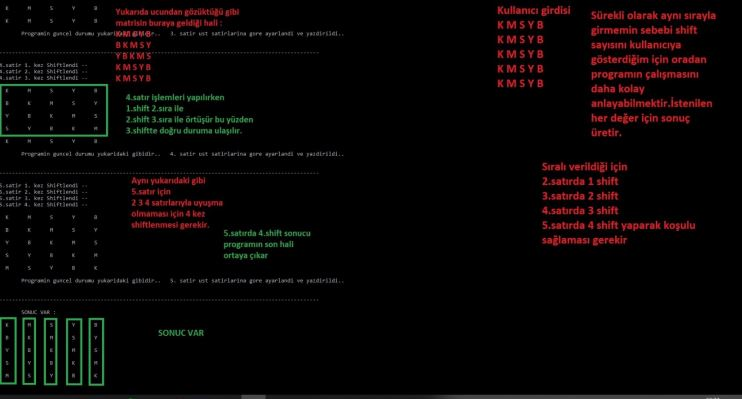
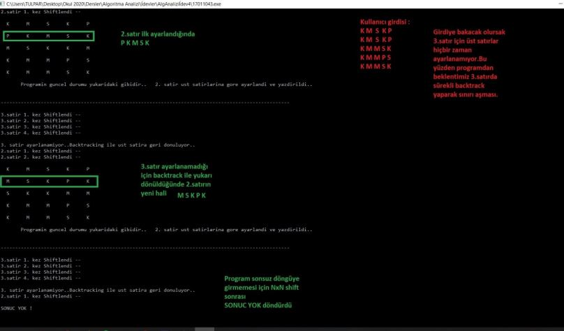

# Backtracking

> **Analysis of Algorithm Assignment-4 (3rd year of University)**

**Example usage of Backtracking** 

# Assignment

On the game board in a NxN matrix view, the same N colors are placed in different rows on each row.

The order of the colors in a row can be changed by **shifting** the colors to the **right**.

For example, if the colors in the row are **red, blue, green, and purple, the new order will be purple, red, blue, green** when the row is moved to the right 1 time. If it is shifted to the right one more time, green, purple, red, blue are obtained.

There will be only **1 of each color in each column** in the result matrix.
Design the algorithm that recursively organizes the lines using the backtracking method.

Check detailed assignment [description](https://github.com/uguraltindal/Backtracking/blob/main/BLM_3021_Assignment_4.pdf). Code is [here](https://github.com/uguraltindal/Backtracking/blob/main/Backtracking.c).

# Program Examples

### Result

### No Result

